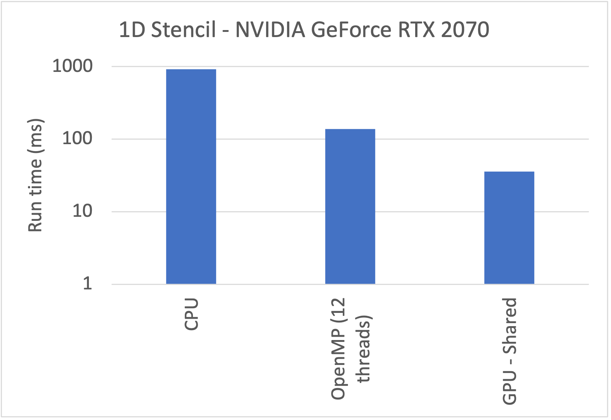
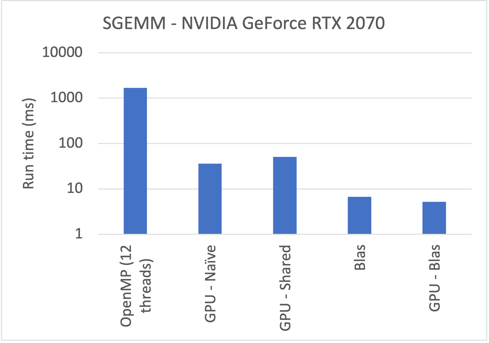
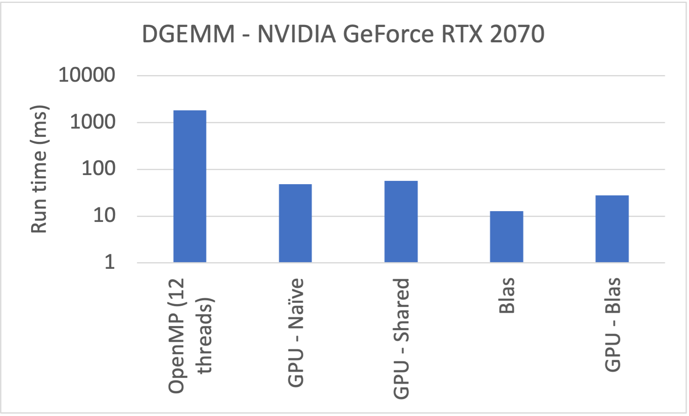

# HW 1
- A stencil operation
- 3 solvers:
    - CPU - Serial
    - CPU - OpenMP
    - GPU - Shared memory
- Problem size:
    - N = 2^24
- The results below are obtained using a personal laptop with NVIDIA GeForce RTX 2070 with Max-Q Design 

# HW 2
- Matrix multiply (SGEMM & DGEMM)
- C = A * B
    - ***A***: a ***M x K*** matrix
    - ***B***: a ***K x N*** matrix
    - ***C***: a ***M x N*** matrix
- Benchmarking case:
    - M = N = K = 1024
- 2D threadblock/grid indexing
- 9 solvers:
    - CPU 
        - Serial
        - Blas
        - Reordered loop index
        - Outer loop index
        - Cache blocking
        - OpenMP
    - GPU 
        - Naive
        - Shared memory
        - Cublas
- SGEMM & DGEMM results with NVIDIA GeForce RTX 2070 with Max-Q Design 

