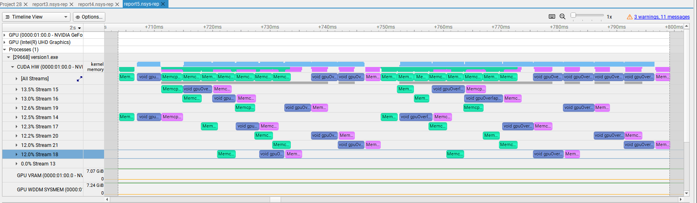

# CUDA Concurrency
- The original repo for this exercise is [here](https://github.com/olcf/cuda-training-series/tree/master/exercises/hw7).
## HW 1
- A personal laptop, ***Hagi***, with NVIDIA GeForce RTX 2070 with Max-Q Design is used for the simulations (with Windows & Microsoft Visual Studio).
- Codes are developed in object oriented fashion.
- ***Pinned*** vectors are created by modifying ***std::vector***s.
- The problem size was set to ~67M (1 << 26).
- The following flags are used while compiling:
```
--default-stream per-thread
-DUSECUDA
```
- Nsight-systems was used for profiling.
- The following line is added at the end of the for loop in the code to overcome the WDDM command queue [problem](https://stackoverflow.com/questions/19944429/cuda-performance-penalty-when-running-in-windows#:~:text=The%20best%20solution%20under%20windows%20is%20to%20switch,Quadro%20family%20of%20GPUs%20--%20i.e.%20not%20GeForce.): 
```
cudaStreamQuery(stream[i]);
```
- In addition to CPU timers, GPU solvers with CUDA events have been developed to measure the GPU time.
- Different sets of numbers of chunk & CUDA streams were used.
- A speedup of around 2 is obtained.
- The following timeline is for the case with the following parameters:
```
CHUNKS = 16
NUM_STREAMS = 8
``` 



- The measured runtimes for this example are as follows:
```
Sequential: 189.59 ms
Overlap   :  95.47 ms
Speedup   :   1.99
```
